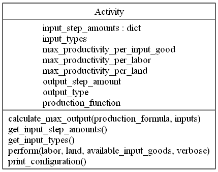

# Activity class (Python 3)

`Activity` holds the properties and methods mediating between a set of input factors (resources, labour, land, and possibly, preconditions) and a set of outputs, according to parameters specific to a certain "activity". For example, an activity "orange juice making" would take a number of oranges, a number of person-hours, a certain area, and the use (and wear) of a certain juice-making tool, returning a number of units of orange juice.

From this generic concept, we build the class to work effectively as a holder for vector and matrices (lists and list of lists holding numeric values) operations. Productivity parameters are defined per each factor separately, as the number required per time unit and factor unit, assuming all other factors remain the same, while the total production per time unit is calculated according to a `production_function`. This function can be specified per each activity, as long as the productivity parameters can be combined linearly (which might be too much a simplification). A straightforward generic function is taking the minimum value of production per each factor (limiting factor principle or Liebig's law of the minimum).

   

